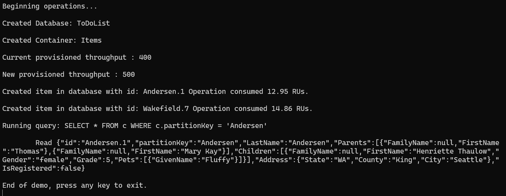
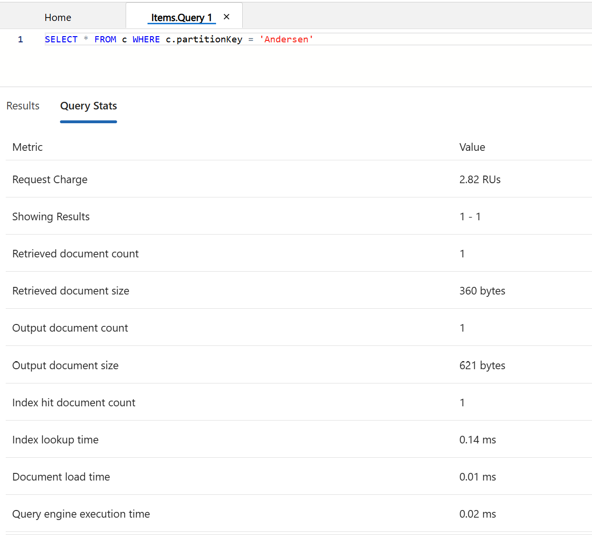

# Demo 1: Explore RU Usage

## Objective
In this demo, we will execute queries from the `query-orders.txt` file and observe the RU (Request Unit) consumption for each query.

---

## Prep

1. **Load Data**  
   Navigate to the `Load Data` folder in your workspace and execute the script to load sample data into your Azure Cosmos DB.  
   - Ensure that the data is loaded into the same database and container used for this demo.

2. **Update Configuration File**  
   Open the configuration file (e.g., `appsettings.json` or `.env`) in the `Load Data` folder and update it with the credentials for the Azure Cosmos DB created in previous demos.  
   Example configuration:
   ```json
   {
     "CosmosDb": {
       "Endpoint": "https://<your-cosmos-db-account>.documents.azure.com:443/",
       "Key": "<your-primary-key>",
       "DatabaseId": "OrdersDatabase",
       "ContainerId": "OrdersContainer"
     }
   }
   ```
3. **Run results**  
    After executing the application, you will get documents generated and observe the following output: 


## Steps

1. **Open the Query File**  
   Navigate to the following file in your workspace:  
   `query-orders.txt`

2. **Run the Queries**  
   Execute each query in your Azure Cosmos DB Query Explorer or your preferred tool.  
   For example:
   - Query 1:
     ```sql
     SELECT * FROM c WHERE c.OrderNumber = "NL-11"
     ```
   - Query 2:
     ```sql
     SELECT DISTINCT o.OrderAddress.City
     FROM Orders o
     ```
   - Query 3:
     ```sql
     SELECT VALUE  { 
       "Order City": o.OrderAddress.City,   
       "Order Number" : o.OrderNumber 
     } 
     FROM Orders o 
     WHERE o.OrderAddress.City IN ('Redmond', 'Seattle')
     ```
   - Query 4:
     ```sql
     SELECT o.id, o.OrderAddress.City
     FROM Orders o  
     WHERE CONTAINS(o.OrderAddress.State, "fl", true)
     ```

3. **Observe RU Consumption**  
   After running each query, observe the RU consumption in the **Query Stats** tab.  
   Example output for a query:
   - Request Charge: `2.82 RUs`
   - Retrieved Document Count: `1`
   - Query Execution Time: `0.02 ms`

4. **Analyze Results**  
   Compare the RU consumption for each query and note how query complexity, filters, and projections affect the RU charge.

---

## Example Query Stats
Below is an example of the query stats for a sample query:



---

## Key Takeaways
- Simple queries with indexed fields consume fewer RUs.
- Complex queries with filters, projections, or non-indexed fields consume more RUs.
- Optimize queries to reduce RU consumption and improve performance.

