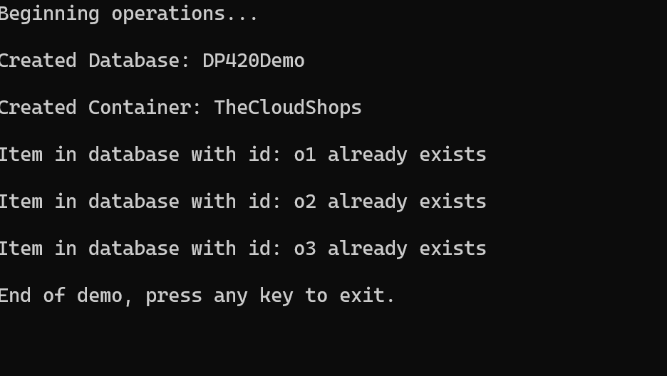

# Demo 1 (.NET): Basic Operations with Azure Cosmos DB SDK for .NET

## Objective
This demo demonstrates how to perform basic operations using the Azure Cosmos DB SDK for .NET.

---

## Prerequisites

1. **Install .NET SDK**  
   Ensure you have the .NET SDK installed on your machine. You can download it from [Microsoft .NET](https://dotnet.microsoft.com/).

2. **Setup Configuration**  
   Update the `App.config` file in the project directory with your Azure Cosmos DB credentials:
   ```xml
   <appSettings>
     <add key="EndpointUri" value="<yourendpoint>" />
     <add key="PrimaryKey" value="<yourkey>" />
   </appSettings>
   ```

3. **Restore Dependencies**  
   Run the following command in the terminal to restore the required dependencies:
   ```bash
   dotnet restore
   ```

4. **Run the Application**  
   Execute the following command to run the application:
   ```bash
   dotnet run
   ```

---

## Steps

### 1. **Initialize the Cosmos Client**
Observe following code in file named `index.js` to initialize the Cosmos DB client:

```csharp
using Microsoft.Azure.Cosmos;

string endpointUri = "<yourendpoint>";
string primaryKey = "<yourkey>";
CosmosClient cosmosClient = new CosmosClient(endpointUri, primaryKey);

Console.WriteLine("Cosmos DB Client Initialized");
```

### 2. **Create Database and Container**
Observe following code to create a database and container:

```csharp
string databaseId = "DemoDatabase";
string containerId = "DemoContainer";

Database database = await cosmosClient.CreateDatabaseIfNotExistsAsync(databaseId);
Console.WriteLine($"Database created: {database.Id}");

Container container = await database.CreateContainerIfNotExistsAsync(containerId, "/partitionKey");
Console.WriteLine($"Container created: {container.Id}");
```

### 3. **Insert Document**
Observe following code insert a document into the container:

```csharp
dynamic document = new
{
    id = "1",
    name = "Sample Item",
    description = "This is a sample document"
};

ItemResponse<dynamic> response = await container.CreateItemAsync(document, new PartitionKey("1"));
Console.WriteLine($"Document created: {response.Resource.id}");
```

### 4. **Query Documents**
Observe following code to query documents from the container:

```csharp
string query = "SELECT * FROM c WHERE c.name = @name";
QueryDefinition queryDefinition = new QueryDefinition(query).WithParameter("@name", "Sample Item");

FeedIterator<dynamic> resultSet = container.GetItemQueryIterator<dynamic>(queryDefinition);

while (resultSet.HasMoreResults)
{
    foreach (var item in await resultSet.ReadNextAsync())
    {
        Console.WriteLine($"Query Result: {item}");
    }
}
```

### 5. **Delete Document**
Observe following code to delete a document from the container:

```csharp
await container.DeleteItemAsync<dynamic>("1", new PartitionKey("1"));
Console.WriteLine("Document deleted");
```

## Run the Demo

1. Open a terminal and navigate to the project directory.

2. Build the project:
   ```bash
   dotnet build
   ```

3. Run the project:
   ```bash
   dotnet run
   ```

Observe the output in the terminal for each operation.

## Example Output
Below is an example of the output after executing the script:

