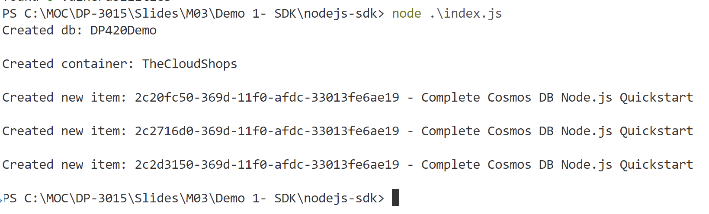

# Demo 1 (Node.js): Basic Operations with Azure Cosmos DB Node.js Client

## Objective
This demo demonstrates how to perform basic operations using the Azure Cosmos DB Node.js SDK.

---

## Prerequisites

1. **Install Node.js**  
   Ensure you have Node.js installed on your machine. You can download it from [Node.js Official Website](https://nodejs.org/).

2. **Install Dependencies**  
   Run the following command in your terminal to install the required Azure Cosmos DB SDK:
   ```bash
   npm install @azure/cosmos
   ```

3. **Setup Configuration**  
   Create a config.json file in the project directory and add your Azure Cosmos DB credentials:
   ```json
   {
     "endpoint": "<yourendpoint>",
     "key": "<yourkey>",
     "databaseId": "DemoDatabase",
     "containerId": "DemoContainer"
   }
   ```

---

## Steps

### 1. **Initialize the Cosmos Client**
Observe following code in file named `index.js` to initialize the Cosmos DB client:
```javascript
const { CosmosClient } = require("@azure/cosmos");
const config = require("./config.json");

const client = new CosmosClient({ endpoint: config.endpoint, key: config.key });
const databaseId = config.databaseId;
const containerId = config.containerId;

async function main() {
  console.log("Cosmos DB Client Initialized");
}

main().catch((error) => console.error(error));
```

### 2. **Create Database and Container**
Observe following code to create a database and container:
```javascript
async function createDatabaseAndContainer() {
  const { database } = await client.databases.createIfNotExists({ id: databaseId });
  console.log(`Database created: ${database.id}`);

  const { container } = await database.containers.createIfNotExists({ id: containerId });
  console.log(`Container created: ${container.id}`);
}
```

### 3. **Insert Document**
Observe following code insert a document into the container:
```javascript
async function insertDocument() {
  const container = client.database(databaseId).container(containerId);
  const document = {
    id: "1",
    name: "Sample Item",
    description: "This is a sample document",
  };

  const { resource } = await container.items.create(document);
  console.log(`Document created: ${resource.id}`);
}
```

### 4. **Query Documents**
Observe following code to query documents from the container:
```javascript
async function queryDocuments() {
  const container = client.database(databaseId).container(containerId);
  const querySpec = {
    query: "SELECT * FROM c WHERE c.name = @name",
    parameters: [{ name: "@name", value: "Sample Item" }],
  };

  const { resources } = await container.items.query(querySpec).fetchAll();
  console.log("Query Results:", resources);
}
```

### 5. **Delete Document**
Observe following code to delete a document from the container:
```javascript
async function deleteDocument() {
  const container = client.database(databaseId).container(containerId);
  const { resource } = await container.item("1").delete();
  console.log(`Document deleted: ${resource.id}`);
}
```


## Run the Demo

1. Open a terminal and navigate to the project directory.

2. Run the following command to execute the script:
   ```bash
   node index.js
   ```

Observe the output in the terminal for each operation.

## Example Output
Below is an example of the output after executing the script:




