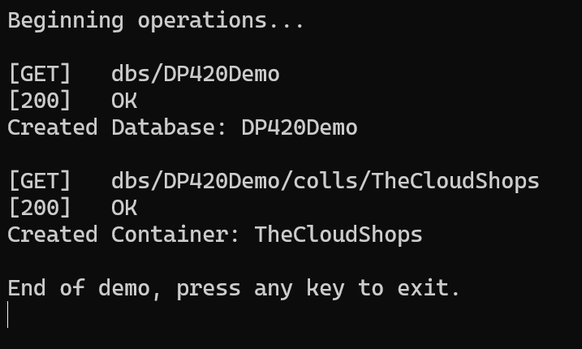

# Demo 2 (.NET): Logging and Basic Operations with Azure Cosmos DB SDK for .NET

## Objective
This demo demonstrates how to configure and perform basic operations with logging using the Azure Cosmos DB SDK for .NET.

---

## Prerequisites

1. **Install .NET SDK**  
   Ensure you have the .NET SDK installed on your machine. You can download it from [Microsoft .NET](https://dotnet.microsoft.com/).

2. **Restore Dependencies**  
   Run the following command in the terminal to restore the required dependencies:
   ```bash
   dotnet restore
   ```

3. **Configure App Settings**  
   Update the `appSettings` in your configuration file with your Azure Cosmos DB `EndpointUri` and `PrimaryKey`:
   ```xml
   <appSettings>
     <add key="EndpointUri" value="<yourendpoint>" />
     <add key="PrimaryKey" value="<yourkey>" />
   </appSettings>
   ```

---

## Logging Configuration

Configure logging in your application to monitor and troubleshoot operations. This can be done in the `Program.cs` file:
```csharp
using Microsoft.Extensions.DependencyInjection;
using Microsoft.Extensions.Hosting;
using Microsoft.Extensions.Logging;

public class Program
{
    public static void Main(string[] args)
    {
        CreateHostBuilder(args).Build().Run();
    }

    public static IHostBuilder CreateHostBuilder(string[] args) =>
        Host.CreateDefaultBuilder(args)
            .ConfigureServices((hostContext, services) =>
            {
                // Add application services
            })
            .ConfigureLogging((context, logging) =>
            {
                logging.ClearProviders();
                logging.AddConsole();
                logging.AddDebug();
            });
}
```

## Run Application

The application performs two operations:  
1. **Database Creation**  
2. **Container Creation**  

The results of these operations, including the status codes from the Cosmos DB response, will be visible in the console output.

To run the application, execute the following command in the terminal:

```bash
dotnet run
```

## Example Output

Below is an example of the output after running the application:



---

## Key Takeaways

- The Azure Cosmos DB SDK for .NET simplifies database and container creation.
- Logging is essential for tracking operations and debugging issues.
- Always handle exceptions and errors for robust applications.