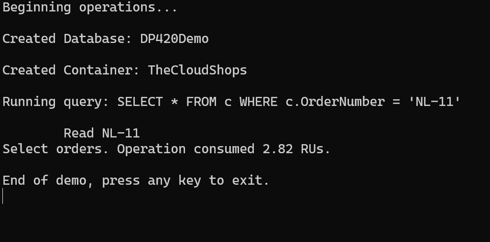

# Demo 1: Query Operations with Azure Cosmos DB SDK for .NET

## Objective
This demo demonstrates how to perform query operations using the Azure Cosmos DB SDK for .NET. It includes creating a database and container, running queries, and observing the RU (Request Unit) consumption.

---

## Prerequisites

1. **Install .NET SDK**  
   Ensure you have the .NET SDK installed on your machine. You can download it from [Microsoft .NET](https://dotnet.microsoft.com/).

2. **Restore Dependencies**  
   Run the following command in the terminal to restore the required dependencies:
   ```bash
   dotnet restore
   ```

3. **Configure App Settings**  
   Update the `app.config` file in your project with your Azure Cosmos DB credentials:
   ```xml
   <appSettings>
     <add key="EndpointUri" value="<yourendpoint>" />
     <add key="PrimaryKey" value="<yourkey>" />
   </appSettings>
   ```

---

## Steps

### 1. Create a Database and Container
The following code to create a database and container in Azure Cosmos DB:
```csharp
        private async Task Initialize()
        {
            this.cosmosClient = new CosmosClient(EndpointUri, PrimaryKey);
            this.database = await cosmosClient.CreateDatabaseIfNotExistsAsync(databaseId);
            this.container = await database.CreateContainerIfNotExistsAsync(containerId, "/partitionKeyPath");
        }
```

---

### 2. Run Queries
To run queries against your data, use the following code:
```csharp
var sqlQueryText = "SELECT * FROM c WHERE c.OrderNumber = 'NL-11'";
QueryDefinition queryDefinition = new QueryDefinition(sqlQueryText);
FeedIterator<MyItem> queryResultSetIterator = container.GetItemQueryIterator<MyItem>(queryDefinition);

while (queryResultSetIterator.HasMoreResults)
{
    FeedResponse<MyItem> currentResultSet = await queryResultSetIterator.ReadNextAsync();
    foreach (MyItem item in currentResultSet)
    {
        Console.WriteLine($"Item found: {item.id}");
    }
}
```

---

### 3. Observe RU Consumption
The RU consumption for each operation is available in the response headers. You can access it as follows:

```csharp
var response = await container.ReadItemAsync<MyItem>("item-id", new PartitionKey("partition-key"));
Console.WriteLine($"RU Charge: {response.RequestCharge}");
```

---

## Run the Demo

1. Open a terminal and navigate to the project directory.
2. **Build the project**:  
   Run the following command:  
   ```bash
   dotnet build
   ```
3. **Run the project**:  
   Execute the application using:  
   ```bash
   dotnet run
   ```
4. Observe the output in the terminal for each operation.

---

## Example Output
Below is an example of the output after running the application:

- **Created Database**: The database `DP420Demo` was successfully created.
- **Created Container**: The container `TheCloudShops` was successfully created.
- **Query Execution**: The query `SELECT * FROM c WHERE c.OrderNumber = 'NL-11'` was executed, and the RU consumption was logged.


---

## Queries
Below are the queries used in this demo from the `query-orders.txt` file:

### Query 1: Retrieve all orders with a specific order number
```sql
SELECT * FROM c WHERE c.OrderNumber = "NL-11"
```

### Query 2: Retrieve distinct cities from the order addresses
```sql
SELECT DISTINCT o.OrderAddress.City
FROM Orders o
```

### Query 3: Retrieve specific fields for orders in specific cities
```sql
SELECT VALUE { 
  "Order City": o.OrderAddress.City,   
  "Order Number": o.OrderNumber 
} 
FROM Orders o 
WHERE o.OrderAddress.City IN ('Redmond', 'Seattle')
```

### Query 4: Retrieve orders where the state contains "fl"
```sql
SELECT o.id, o.OrderAddress.City
FROM Orders o  
WHERE CONTAINS(o.OrderAddress.State, "fl", true)
```

---

## Key Takeaways

- The Azure Cosmos DB SDK for .NET simplifies query execution and provides detailed RU consumption metrics.
- Query complexity and filters directly impact RU consumption.
- Always optimize queries to reduce RU usage and improve performance.