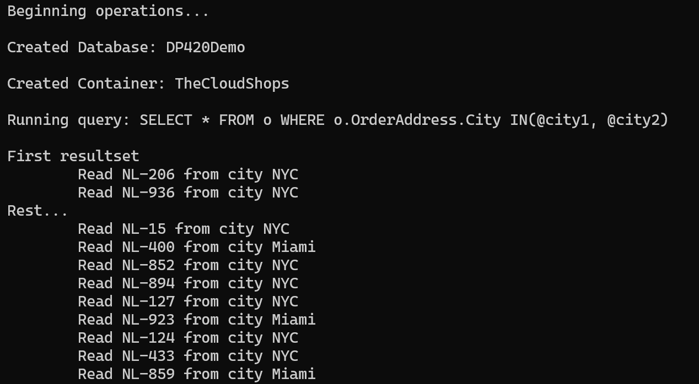

# Demo 2: Advanced Query Operations with Azure Cosmos DB SDK for .NET

## Objective
This demo showcases advanced query operations using the Azure Cosmos DB SDK for .NET. It includes creating a database and container, running parameterized and paginated queries, and analyzing the output.

---

## Prerequisites

1. **Install .NET SDK**  
   Ensure you have the .NET SDK installed on your machine. You can download it from [Microsoft .NET](https://dotnet.microsoft.com/).

2. **Restore Dependencies**  
   Run the following command in the terminal to restore the required dependencies:
   ```bash
   dotnet restore
   ```

3. **Configure App Settings**  
   Update the `app.config` file in your project with your Azure Cosmos DB credentials:
   ```xml
   <appSettings>
     <add key="EndpointUri" value="<yourendpoint>" />
     <add key="PrimaryKey" value="<yourkey>" />
   </appSettings>
   ```

---

## 1. Steps to demonstrate

### 1. Create a Database and Container
The project includes code to create a database and container in Azure Cosmos DB. Ensure the database and container are created before running the queries.

```csharp
        private async Task Initialize()
        {
            this.cosmosClient = new CosmosClient(EndpointUri, PrimaryKey);
            this.database = await cosmosClient.CreateDatabaseIfNotExistsAsync(databaseId);
            this.container = await database.CreateContainerIfNotExistsAsync(containerId, "/partitionKeyPath");
        }
```

---

### 2. Run Queries with Parameters
To run queries against your data, use the following code:
```csharp
var sqlQueryText = @"
    SELECT * FROM Orders o 
    WHERE o.OrderAddress.City = @city";

QueryDefinition queryDefinition = new QueryDefinition(sqlQueryText)
    .WithParameter("@city", "Seattle");

FeedIterator<Order> queryResultSetIterator = container.GetItemQueryIterator<Order>(queryDefinition);

while (queryResultSetIterator.HasMoreResults)
{
    FeedResponse<Order> currentResultSet = await queryResultSetIterator.ReadNextAsync();
    foreach (Order order in currentResultSet)
    {
        Console.WriteLine($"Order ID: {order.Id}, City: {order.OrderAddress.City}");
    }
}
```
---

### 3. Manage Results Pagination
This snippet demonstrates how to paginate query results effectively in Azure Cosmos DB. To manage page size and split results into pages of two records and rest records. You can use the following code snippet from the project:

```csharp
var sqlQueryText = "SELECT * FROM Orders o WHERE o.OrderAddress.City IN (@city1, @city2)";
QueryDefinition queryDefinition = new QueryDefinition(sqlQueryText)
    .WithParameter("@city1", "NYC")
    .WithParameter("@city2", "Miami");

FeedIterator<dynamic> queryResultSetIterator = container.GetItemQueryIterator<dynamic>(
    queryDefinition,
    requestOptions: new QueryRequestOptions { MaxItemCount = 2 } // Set page size to 2
);

int pageNumber = 1;
while (queryResultSetIterator.HasMoreResults)
{
    Console.WriteLine($"Page {pageNumber++}:");
    FeedResponse<dynamic> currentResultSet = await queryResultSetIterator.ReadNextAsync();
    foreach (var item in currentResultSet)
    {
        Console.WriteLine($"Order ID: {item.id}, City: {item.OrderAddress.City}");
    }
    Console.WriteLine("----");
}
```

**Explanation:**
- **`MaxItemCount`**: Limits the number of records returned per page to 2.
- **Pagination**: Each call to `ReadNextAsync()` retrieves the next page of results.
- **Output**: The results are split into pages, with each page containing up to 2 records.

**Example Output:**
```
Page 1:
first two records
----
Page 2:
other records

```

## 2. Run the Project
To run the project, follow these steps:

1. Open a terminal and navigate to the project directory.
2. **Build the project**:  
   Run the following command:  
   ```bash
   dotnet build
   ```
3. **Run the project**:  
   Execute the application using:  
   ```bash
   dotnet run
   ```

---

## 3. Example Output
After running the project, you will see output similar to the following:



**Explanation of the Output:**
- **Created Database**: The database `DP420Demo` was successfully created.
- **Created Container**: The container `TheCloudShops` was successfully created.
- **Query Execution**: The query `SELECT * FROM o WHERE o.OrderAddress.City IN(@city1, @city2)` was executed.
- **Results**: The output lists the orders retrieved from the specified cities, including their IDs and cities.

---

## 4. Add an Additional Query
The following query from the `query.txt` file retrieves product names and their total counts from orders:

```sql
SELECT products.ProductItem.ProductName as Name, SUM(products.Count) as Count
FROM Orders o 
JOIN products IN o.OrderItems
GROUP BY products.ProductItem.ProductName
```

**Description:**
- This query uses the `JOIN` clause to access nested `OrderItems` within each order.
- It groups the results by product name and calculates the total count for each product.

**Code to Execute the Query:**
Add the following code to your project to execute the query:

```csharp
var sqlQueryText = @"
    SELECT products.ProductItem.ProductName as Name, SUM(products.Count) as Count
    FROM Orders o 
    JOIN products IN o.OrderItems
    GROUP BY products.ProductItem.ProductName";

QueryDefinition queryDefinition = new QueryDefinition(sqlQueryText);
FeedIterator<dynamic> queryResultSetIterator = container.GetItemQueryIterator<dynamic>(queryDefinition);

while (queryResultSetIterator.HasMoreResults)
{
    FeedResponse<dynamic> currentResultSet = await queryResultSetIterator.ReadNextAsync();
    foreach (var item in currentResultSet)
    {
        Console.WriteLine($"Product: {item.Name}, Total Count: {item.Count}");
    }
}
```

---

## Key Takeaways

- The Azure Cosmos DB SDK for .NET supports advanced query operations, including parameterized and paginated queries.
- Grouping and aggregation queries can be used to analyze data efficiently.
- Always monitor RU consumption to optimize query performance.